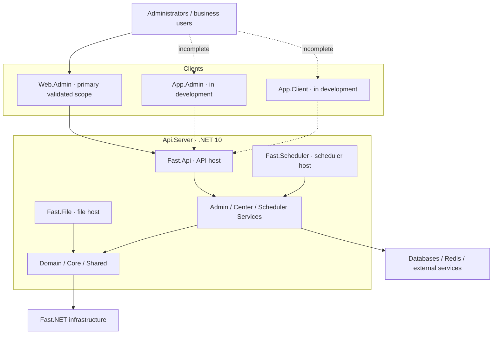

[简体中文](README.zh.md) | [**English**](README.md)

<p align="center">
  
</p>

<h1 align="center">Fast.Admin</h1>

<p align="center">
  A modern open-source administration system built on Fast.NET
</p>

<p align="center">
  
  
  
  
  <a href="LICENSE"></a>
</p>

Fast.Admin is a separated frontend/backend open-source project for enterprise administration scenarios. It uses [Fast.NET](https://gitee.com/FastDotnet/Fast.NET) as its server-side infrastructure and provides organization and permission management, system configuration, operations monitoring, job scheduling, and common business administration capabilities. Its modular repository layout allows adopters to select the Web console, server applications, and future multi-platform clients as needed.

> **Current maturity:** The primary validated scope is `Web.Admin` and `Api.Server`. `App.Admin` (administrator app) and `App.Client` (mobile client app) are still under development. They must not be treated as finished products and are not recommended for production use.
>
> **Important disclaimer:** This project may only be used for lawful, compliant, and duly authorized purposes. It must not be used for illegal or criminal activity. Users are solely responsible for the compliance of deployment, configuration, data processing, derivative development, and operations. Read [Disclaimer and compliance requirements](#disclaimer-and-compliance-requirements) before use.

## Why Fast.Admin

- **Separated frontend and backend**: ASP.NET Core on the server and Vue 3, TypeScript, Vite, and Element Plus for the Web console.
- **Built on Fast.NET**: Reuses caching, dependency injection, JWT, logging, dynamic APIs, OpenAPI, serialization, SqlSugar, Swagger, and unified-result infrastructure.
- **Administration fundamentals**: Covers tenants, organizations, departments, employees, positions, roles, applications, menus, APIs, settings, dictionaries, and database administration.
- **Operational governance**: Includes API rate limiting, access and operation logs, exception and SQL logs, online users, system monitoring, SignalR, and Quartz administration.
- **Multi-platform roadmap**: Separate Web, administrator-app, and mobile-client projects are present, with unfinished clients explicitly marked.
- **Engineering safeguards**: Centralized .NET dependency management plus frontend type checking, ESLint, Prettier, and production build workflows.

## Project status

| Directory                  | Purpose                    | Status                     | Notes                                                                        |
| -------------------------- | -------------------------- | -------------------------- | ---------------------------------------------------------------------------- |
| [`Web.Admin`](Web.Admin)   | Web administration console | ✅ Primary validated scope | Main administration UI currently available                                   |
| [`Api.Server`](Api.Server) | .NET server                | ✅ Primary validated scope | Contains API, file, and scheduler hosts plus domain and application services |
| [`App.Admin`](App.Admin)   | Administrator app          | 🚧 In development          | Built with uni-app; features and platform support are incomplete             |
| [`App.Client`](App.Client) | Mobile client app          | 🚧 In development          | Built with uni-app; features and platform support are incomplete             |

These labels describe the current maintenance and validation scope only. They do not guarantee coverage of every operating system, database, browser, device, or production deployment combination.

## Development Roadmap

> “Completed” means that the repository currently contains the corresponding primary server implementation and Web administration pages. It does not mean that every production environment, third-party integration, or edge case has been validated. Planned items have no committed release or delivery date, and their priority and scope may change with actual requirements.

### Completed

- [x] Separated frontend/backend foundation built with .NET 10, ASP.NET Core, Fast.NET, and Vue 3.
- [x] Foundational tenant, application, database-configuration, account, and multi-organization management.
- [x] Organization, department, employee, position, job-level, role, menu, and API permission management.
- [x] System settings, data dictionaries, serial-number rules, table configuration, and password-record management.
- [x] Login CAPTCHA, password recovery, account identity verification, session management, and forced sign-out.
- [x] Visit, request, operation, exception, and SQL logs, plus online-user and system monitoring.
- [x] Separate Quartz 3 scheduler service, scheduler administration UI, and local/URL job support.
- [x] Separate file service and file-record administration.
- [x] OpenAPI, Swagger, Knife4j, and API metadata administration.
- [x] Common business modules for merchants, client users, payment records, refund records, complaint handling, and message-delivery records.

### Incomplete / Planned

- [ ] **Quartz 4 upgrade**: Upgrade dependencies and validate database schema, persistence, serialization, and existing job compatibility.
- [ ] **Message center**: Build on the current SMS, email, and delivery-record capabilities with in-app messages, templates, inboxes, unread state, receipts, push delivery, and channel management.
- [ ] **Online chat**: Extend the SignalR foundation with direct and group conversations, conversation lists, message persistence, read receipts, and offline messages.
- [ ] **Workflow engine**: Add visual process design, definitions and versions, process instances, tasks, approvals, countersigning, transfers, carbon copies, reminders, and audit records.
- [ ] **Administrator app**: Continue completing `App.Admin` features, authorization, interaction design, and multi-platform support.
- [ ] **Client app**: Continue completing `App.Client` user-facing business capabilities and multi-platform support.
- [ ] **Single sign-on and external identity providers**: Evaluate and integrate OIDC, OAuth 2.0, WeCom, DingTalk, and similar authentication methods.
- [ ] **Code generation and low-code configuration**: Gradually add generation for models, APIs, forms, lists, and foundational business code.
- [ ] **Automated quality assurance**: Improve unit, integration, and end-to-end tests, CI, and release checks.
- [ ] **Deployment and observability**: Improve Docker, container orchestration, health checks, metrics, distributed tracing, and alert integrations.
- [ ] **Internationalization and accessibility**: Add multilingual content, time-zone and regional formatting, and accessibility support.
- [ ] **Compatibility and documentation**: Continue improving the database compatibility matrix, deployment documentation, development examples, and public demonstration environment.

## Interface Preview

> Click a thumbnail to view the full-size image. Some screenshots may come from production systems created through secondary development of this project and are provided only to demonstrate the interface. Business data and sensitive information must be redacted before publication, and the screens may differ from the open-source version.

<table>
  <tr>
    <td align="center"><br />Login</td>
    <td align="center"><br />Data Dashboard</td>
    <td align="center"><br />Dashboard</td>
    <td align="center"><br />System Monitor</td>
    <td align="center"><br />Data Dictionary</td>
  </tr>
  <tr>
    <td align="center"><br />Table Configuration</td>
    <td align="center"><br />Menu Management</td>
    <td align="center"><br />Scheduled Jobs</td>
    <td align="center"><br />Role Management</td>
    <td align="center"><br />Department Management</td>
  </tr>
</table>

## Core capabilities

- Tenant, account, organization, department, employee, position, job-level, and role management.
- Application, menu, API, dictionary, configuration, database, serial-number, and table configuration management.
- Login, visit, request, operation, exception, and SQL execution logs.
- Online users, system monitoring, API rate limiting, JWT authentication, and SignalR communication.
- Quartz job administration, a separate file service, and OpenAPI/Swagger documentation.
- Common business modules for merchants, client users, payments, refunds, complaints, and message delivery records.

Exact features, authorization boundaries, and third-party service availability depend on the current source, configuration, and deployment environment.

## Technology and compatibility

| Area         | Current stack                                                                    |
| ------------ | -------------------------------------------------------------------------------- |
| Server       | .NET 10, ASP.NET Core, Fast.NET, SqlSugar, Redis, JWT, SignalR, Quartz           |
| Web console  | Vue 3.5, TypeScript 6, Vite 8, Element Plus, Pinia, Axios, ECharts               |
| App projects | uni-app, Vue 3.4, TypeScript 6, Vite 5, Wot UI 2 (`@wot-ui/ui`) (in development) |
| Node.js      | `^24.18.0`                                                                       |
| pnpm         | `^11.0.0`                                                                        |
| License      | Apache-2.0                                                                       |

The server currently targets `net10.0`. Before deployment, make sure the installed SDK, Node.js, pnpm, database, and Redis environment match the project configuration.

## Architecture



## Repository layout

```text
Fast.Admin/
├─ Api.Server/                 # .NET 10 server solution
│  ├─ src/Fast.Api/            # Main API host, default port 38081
│  ├─ src/Fast.File/           # File host, default port 38082
│  ├─ src/Fast.Scheduler/      # Scheduler host, default port 38083
│  ├─ src/*.Service/           # Application services
│  ├─ src/*.Domain/            # Domain models
│  └─ src/Core, src/Shared/    # Core and shared infrastructure
├─ Web.Admin/                  # Vue 3 Web console, default port 2001
├─ App.Admin/                  # uni-app administrator app, in development
├─ App.Client/                 # uni-app mobile client app, in development
├─ Sql/                        # Database scripts
├─ README.zh.md / README.md    # Chinese and English project documentation
└─ LICENSE                     # Apache-2.0 license
```

## Quick start

### 1. Prerequisites

- .NET SDK 10.0
- Node.js 24.18 or a compatible version
- pnpm 11
- A database and Redis instance matching the server configuration

### 2. Configure the server

Review and configure these files for the target environment:

- `Api.Server/src/Core/coresettings.json`
- `Api.Server/src/Core/coresettings.Development.json`
- `Api.Server/src/Core/dbsettings.json`
- `Api.Server/src/Core/dbsettings.Development.json`

Production deployments must replace default or development database, Redis, JWT, and CORS settings. Never commit real passwords, secrets, tokens, or connection details.

### 3. Start the main API

```bash
cd Api.Server
dotnet restore Fast.Admin.sln
dotnet run --project src/Fast.Api/Fast.Api.csproj
```

The main API listens on `http://127.0.0.1:38081` by default. Start the file and scheduler hosts separately when needed:

```bash
dotnet run --project src/Fast.File/Fast.File.csproj
dotnet run --project src/Fast.Scheduler/Fast.Scheduler.csproj
```

### 4. Start the Web console

```bash
cd Web.Admin
pnpm install --frozen-lockfile
pnpm dev
```

The development server is available at `http://127.0.0.1:2001` by default and proxies `/api` to the main API. Make sure the proxy in `Web.Admin/.env.development` matches the server address.

> `App.Admin` and `App.Client` are incomplete and are intentionally excluded from the official quick-start flow for now.

## Local build

Server:

```bash
cd Api.Server
dotnet restore Fast.Admin.sln
dotnet build Fast.Admin.sln -c Release --no-restore
```

Web console:

```bash
cd Web.Admin
pnpm install --frozen-lockfile
pnpm build
```

A successful build only confirms the current project build workflow. It does not mean that a production environment, database, cache, SMS, email, payment, or other third-party integration has been validated.

## Branches

| Branch    | Purpose          | Recommendation                                                        |
| --------- | ---------------- | --------------------------------------------------------------------- |
| `master`  | Stable branch    | Prefer this branch for forks, learning, and production evaluation     |
| `develop` | Iteration branch | Contains work in progress and must be tested independently before use |

## Documentation and collaboration

- [Nginx reverse proxy deployment template](docs/DEPLOYMENT.md)
- [Fast.NET](https://gitee.com/FastDotnet/Fast.NET)
- [Commit history](https://gitee.com/FastDotnet/Fast.Admin/commits/master)
- [Issue tracker](https://gitee.com/FastDotnet/Fast.Admin/issues)
- [Pull requests](https://gitee.com/FastDotnet/Fast.Admin/pulls)

Before submitting changes, complete at least the relevant build, type check, or tests for the affected project, and keep public Chinese and English documentation synchronized. Issues and pull requests are welcome.

## Disclaimer and compliance requirements

> **Do not use this project for any activity that violates the laws of the People's Republic of China, the laws applicable where it is used, or the lawful rights of any third party.**

1. This project is provided only for lawful learning, research, internal administration, and duly authorized business scenarios. It must not be used for cyberattacks, unauthorized access, fraud, gambling, money laundering, privacy violations, unlawful collection or trading of data, evasion of regulation, distribution of illegal content, or any other unlawful or criminal purpose.
2. Users must independently ensure that their use, deployment, derivative development, data collection and processing, content operations, API calls, and external services have all required rights, authorization, qualifications, licenses, and security controls. Users are solely responsible for the resulting legal obligations and liabilities.
3. When processing personal information, important data, accounts and permissions, payments, SMS, email, files, logs, or third-party platforms, users must comply with applicable data protection, cybersecurity, consumer protection, and industry requirements, including appropriate notice, consent, minimization, encryption, auditing, backup, and access control.
4. The software is provided on an "AS IS" basis, without promises that it is defect-free, uninterrupted, completely secure, or suitable for a particular purpose. To the extent permitted by applicable law, the authors and contributors are not liable for loss, disputes, or obligations resulting from use, inability to use, misconfiguration, derivative development, data breaches, data loss, business interruption, third-party service failures, or unlawful use.
5. Example configuration, initialization data, scripts, and third-party integrations in this repository are for development reference only. Before production use, conduct an independent security review, compliance assessment, load test, backup and recovery validation, and any necessary professional review.
6. This notice is not legal advice and does not replace applicable law, regulatory requirements, or professional legal counsel. Use, copying, modification, and distribution are also subject to the [Apache License 2.0](LICENSE) and relevant third-party licenses.

By downloading, using, or creating a derivative work from this project, the user acknowledges the risks and responsibilities above. If you do not agree, stop using the project and remove all related copies.

## License

Fast.Admin is open source under the [Apache License 2.0](LICENSE). Use, modification, and distribution must comply with the license, applicable third-party licenses, and applicable law.

## Maintainer

Created and maintained by **XiaoFang (1.8K 仔)**. Fast.Admin continues to bring together practical ideas and infrastructure to offer the .NET open-source ecosystem a modern administration-system option.
