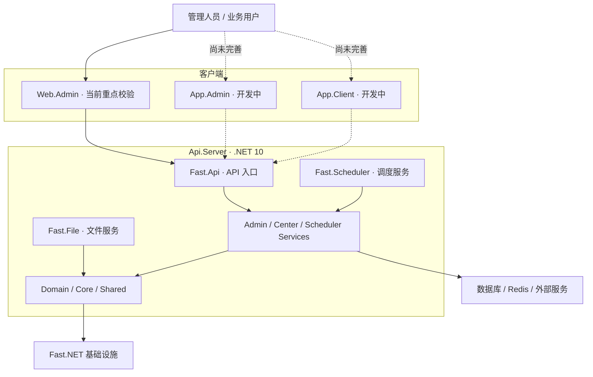

[**简体中文**](README.zh.md) | [English](README.md)

<p align="center">
  
</p>

<h1 align="center">Fast.Admin</h1>

<p align="center">
  基于 Fast.NET 的现代化开源管理系统
</p>

<p align="center">
  
  
  
  
  <a href="LICENSE"></a>
</p>

Fast.Admin 是一个面向企业管理场景的前后端分离开源项目，以 [Fast.NET](https://gitee.com/FastDotnet/Fast.NET) 为服务端基础设施，提供组织权限、系统配置、运行监控、任务调度及常用业务管理能力。项目采用模块化目录，可根据实际场景选择 Web 管理端、服务端和后续多端应用。

> **当前完成度：** 目前重点校验范围为 `Web.Admin` 和 `Api.Server`。`App.Admin`（管理端 APP）与 `App.Client`（移动端 APP）仍在开发完善中，不应视为已完成产品，也不建议直接用于生产环境。
>
> **重要免责声明：** 本项目只能用于合法、合规并已获得授权的场景。严禁利用本项目从事任何违法犯罪活动；使用者应对部署、配置、数据处理、二次开发及实际运营承担全部合规责任。使用前请务必阅读[免责声明与合规要求](#免责声明与合规要求)。

## 为什么选择 Fast.Admin

- **前后端分离**：服务端使用 ASP.NET Core，Web 管理端使用 Vue 3、TypeScript、Vite 和 Element Plus。
- **基于 Fast.NET**：复用缓存、依赖注入、JWT、日志、动态 API、OpenAPI、序列化、SqlSugar、Swagger 和统一响应等基础能力。
- **管理能力完整**：覆盖租户、组织、部门、员工、职位、角色、应用、菜单、接口、配置、字典和数据库管理等常见后台模块。
- **运行治理**：提供接口限流、访问与操作日志、异常与 SQL 日志、在线用户、系统监控、SignalR 和 Quartz 调度管理等能力。
- **多端规划**：仓库已包含 Web 管理端、管理端 APP 和移动端 APP 的独立工程，未完成端会明确标注状态。
- **工程化约束**：集中管理 .NET 依赖，并为前端配置类型检查、ESLint、Prettier 和生产构建流程。

## 项目状态

| 目录                       | 定位        | 当前状态    | 说明                                       |
| -------------------------- | ----------- | ----------- | ------------------------------------------ |
| [`Web.Admin`](Web.Admin)   | Web 管理端  | ✅ 重点校验 | 当前主要可用的管理界面                     |
| [`Api.Server`](Api.Server) | .NET 服务端 | ✅ 重点校验 | 包含 API、文件、调度入口以及领域与业务服务 |
| [`App.Admin`](App.Admin)   | 管理端 APP  | 🚧 开发中   | 基于 uni-app，功能与适配尚未完善           |
| [`App.Client`](App.Client) | 移动端 APP  | 🚧 开发中   | 基于 uni-app，功能与适配尚未完善           |

上述状态只说明当前仓库的维护与校验范围，不代表已经覆盖所有操作系统、数据库、浏览器、设备和生产部署组合。

## 开发计划

> “已完成”表示当前仓库中已经存在对应的主要服务端代码和 Web 管理页面，不代表所有生产环境、第三方服务和边界场景均已完成验证。规划内容不承诺具体版本或完成时间，优先级和实现范围可能根据实际需求调整。

### 已完成

- [x] 基于 .NET 10、ASP.NET Core、Fast.NET 与 Vue 3 的前后端分离基础框架。
- [x] 租户、应用、数据库配置、账号及多组织管理基础能力。
- [x] 组织、部门、职员、职位、职级、角色、菜单和接口权限管理。
- [x] 系统配置、数据字典、序号配置、表格配置及密码记录管理。
- [x] 登录图形验证码、密码找回、账号身份验证、会话管理和强制下线。
- [x] 访问、请求、操作、异常及 SQL 日志，以及在线用户和系统监控。
- [x] 基于 Quartz 3 的独立调度服务、调度管理页面及本地/URL 作业支持。
- [x] 独立文件服务和文件记录管理。
- [x] OpenAPI、Swagger、Knife4j 和接口元数据管理。
- [x] 商户、客户端用户、支付记录、退款记录、投诉处理及消息发送记录等通用业务模块。

### 未完成 / 规划中

- [ ] **Quartz 4 升级**：完成依赖升级、数据库表结构、持久化、序列化及现有调度任务的兼容验证。
- [ ] **消息中心**：在现有短信、邮件和发送记录能力上，补充站内信、消息模板、收件箱、未读状态、回执、推送及渠道管理。
- [ ] **在线聊天**：基于 SignalR 补充单聊、群聊、会话列表、消息持久化、已读回执和离线消息。
- [ ] **流程引擎**：提供流程设计、定义与版本、流程实例、待办、审批、会签、转办、抄送、催办及审计记录。
- [ ] **管理端 APP**：继续完善 `App.Admin` 的功能、权限、交互和多平台适配。
- [ ] **客户端 APP**：继续完善 `App.Client` 的用户端业务能力和多平台适配。
- [ ] **单点登录与第三方身份源**：评估并接入 OIDC、OAuth 2.0、企业微信、钉钉等认证方式。
- [ ] **代码生成与低代码配置**：逐步补充模型、接口、表单、列表和基础业务代码的生成能力。
- [ ] **自动化质量保障**：完善单元测试、集成测试、端到端测试、CI 和发布检查。
- [ ] **部署与可观测性**：完善 Docker、容器编排、健康检查、指标、链路追踪和告警接入。
- [ ] **国际化与可访问性**：补充多语言、时区、区域格式及无障碍支持。
- [ ] **兼容性与文档**：持续完善数据库兼容矩阵、部署文档、开发示例和公开演示环境。

## 界面预览

> 点击缩略图可查看原图。部分截图可能来自基于本项目二次开发并已实际投入生产的系统，仅用于展示界面效果；公开前应对业务数据和敏感信息完成脱敏，界面与开源版本可能存在差异。

<table>
  <tr>
    <td align="center"><br />登录</td>
    <td align="center"><br />数据大屏</td>
    <td align="center"><br />工作台</td>
    <td align="center"><br />系统监控</td>
    <td align="center"><br />数据字典</td>
  </tr>
  <tr>
    <td align="center"><br />表格配置</td>
    <td align="center"><br />菜单管理</td>
    <td align="center"><br />调度任务</td>
    <td align="center"><br />角色管理</td>
    <td align="center"><br />部门管理</td>
  </tr>
</table>

## 核心能力

- 租户、账号、组织、部门、员工、职位、职级与角色权限。
- 应用、菜单、接口、字典、配置、数据库、序列号与表格配置。
- 登录、访问、请求、操作、异常及 SQL 执行相关日志。
- 在线用户、系统监控、接口限流、JWT 认证和 SignalR 通信。
- Quartz 任务调度、独立文件服务及 OpenAPI/Swagger 文档。
- 商户、客户端用户、支付、退款、投诉、消息发送记录等通用业务模块。

具体功能、权限边界和第三方服务可用性以当前源码、配置与实际部署环境为准。

## 技术栈与兼容性

| 范围       | 当前技术栈                                                               |
| ---------- | ------------------------------------------------------------------------ |
| 服务端     | .NET 10、ASP.NET Core、Fast.NET、SqlSugar、Redis、JWT、SignalR、Quartz   |
| Web 管理端 | Vue 3.5、TypeScript 6、Vite 8、Element Plus、Pinia、Axios、ECharts       |
| APP 工程   | uni-app、Vue 3.4、TypeScript 6、Vite 5、Wot UI 2（`@wot-ui/ui`，开发中） |
| Node.js    | `^24.18.0`                                                               |
| pnpm       | `^11.0.0`                                                                |
| 许可证     | Apache-2.0                                                               |

服务端当前目标框架为 `net10.0`。准备部署前，请确认本机 SDK、Node.js、pnpm、数据库和 Redis 环境与项目配置匹配。

## 项目架构



## 仓库结构

```text
Fast.Admin/
├─ Api.Server/                 # .NET 10 服务端解决方案
│  ├─ src/Fast.Api/            # 主 API 入口，默认端口 38081
│  ├─ src/Fast.File/           # 文件服务入口，默认端口 38082
│  ├─ src/Fast.Scheduler/      # 调度服务入口，默认端口 38083
│  ├─ src/*.Service/           # 业务服务
│  ├─ src/*.Domain/            # 领域模型
│  └─ src/Core、src/Shared/    # 核心与共享基础设施
├─ Web.Admin/                  # Vue 3 Web 管理端，默认端口 2001
├─ App.Admin/                  # uni-app 管理端 APP，开发中
├─ App.Client/                 # uni-app 移动端 APP，开发中
├─ Sql/                        # 数据库脚本
├─ README.zh.md / README.md    # 中英文项目说明
└─ LICENSE                     # Apache-2.0 许可证
```

## 快速开始

### 1. 准备环境

- .NET SDK 10.0
- Node.js 24.18 或兼容版本
- pnpm 11
- 与服务端配置匹配的数据库和 Redis

### 2. 配置服务端

按实际环境检查并配置以下文件：

- `Api.Server/src/Core/coresettings.json`
- `Api.Server/src/Core/coresettings.Development.json`
- `Api.Server/src/Core/dbsettings.json`
- `Api.Server/src/Core/dbsettings.Development.json`

生产环境必须替换数据库、Redis、JWT、跨域等配置中的默认值或开发值。不要把真实密码、密钥、Token 和连接信息提交到仓库。

### 3. 启动主 API

```bash
cd Api.Server
dotnet restore Fast.Admin.sln
dotnet run --project src/Fast.Api/Fast.Api.csproj
```

主 API 默认监听 `http://127.0.0.1:38081`。文件服务和调度服务可根据需要分别启动：

```bash
dotnet run --project src/Fast.File/Fast.File.csproj
dotnet run --project src/Fast.Scheduler/Fast.Scheduler.csproj
```

### 4. 启动 Web 管理端

```bash
cd Web.Admin
pnpm install --frozen-lockfile
pnpm dev
```

开发服务器默认访问地址为 `http://127.0.0.1:2001`，并通过 `/api` 代理到主 API。请先确认 `Web.Admin/.env.development` 中的代理地址与服务端一致。

> `App.Admin` 和 `App.Client` 尚未完善，本 README 暂不将其作为正式快速开始流程。

## 本地构建

服务端：

```bash
cd Api.Server
dotnet restore Fast.Admin.sln
dotnet build Fast.Admin.sln -c Release --no-restore
```

Web 管理端：

```bash
cd Web.Admin
pnpm install --frozen-lockfile
pnpm build
```

构建成功只说明对应工程通过了当前构建流程，不等同于生产环境、数据库、缓存、短信、邮件、支付或其他第三方服务已经完成集成验证。

## 分支说明

| 分支      | 定位     | 建议                               |
| --------- | -------- | ---------------------------------- |
| `master`  | 稳定分支 | Fork、学习或生产评估时优先选择     |
| `develop` | 迭代分支 | 包含开发中的功能，使用前应自行测试 |

## 文档与协作

- [Nginx 反向代理部署模板](docs/DEPLOYMENT.zh.md)
- [Fast.NET](https://gitee.com/FastDotnet/Fast.NET)
- [更新记录](https://gitee.com/FastDotnet/Fast.Admin/commits/master)
- [问题反馈](https://gitee.com/FastDotnet/Fast.Admin/issues)
- [参与贡献](https://gitee.com/FastDotnet/Fast.Admin/pulls)

提交代码前，请至少完成受影响工程的编译、类型检查或相关测试，并保持中英文公共文档同步。欢迎通过 Issue 和 Pull Request 参与完善项目。

## 免责声明与合规要求

> **请勿将本项目用于任何违反中华人民共和国法律法规、使用地法律法规或侵犯第三方合法权益的活动。**

1. 本项目仅供合法的学习、研究、内部管理以及已获得充分授权的业务场景使用。严禁用于网络攻击、非法侵入、诈骗、赌博、洗钱、侵犯隐私、非法采集或交易数据、绕过监管、传播违法信息，以及其他违法犯罪活动。
2. 使用者应自行确认其使用、部署、二次开发、数据收集与处理、内容运营、接口调用及对外提供服务等行为具备必要的权利、授权、资质、许可和安全措施，并独立承担由此产生的全部法律责任。
3. 涉及个人信息、重要数据、账号权限、支付、短信、邮件、文件、日志或第三方平台时，使用者应遵守适用的数据保护、网络安全、消费者保护和行业监管要求，并妥善完成告知、同意、最小化、加密、审计、备份和访问控制。
4. 本软件按照“原样”提供，不承诺无缺陷、不中断、绝对安全或适用于任何特定目的。作者和贡献者不对因使用、无法使用、配置不当、二次开发、数据泄露、数据丢失、业务中断、第三方服务异常或违法使用而产生的损失、纠纷或责任负责，但适用法律另有强制规定的除外。
5. 仓库中的示例配置、初始化数据、脚本和第三方服务接入仅用于开发参考。生产使用前必须完成独立的安全审查、合规评估、压力测试、备份恢复验证和必要的专业审核。
6. 本声明不构成法律意见，也不能替代适用法律、监管要求或专业法律咨询。使用、复制、修改和分发本项目时，还必须遵守 [Apache License 2.0](LICENSE) 及相关第三方许可证。

下载、使用或二次开发本项目，即表示使用者已阅读并理解上述风险与责任边界。若不同意，请停止使用并删除相关副本。

## 许可证

Fast.Admin 基于 [Apache License 2.0](LICENSE) 开源。使用、修改和分发本项目时，请遵守许可证、第三方组件许可证及适用法律。

## 维护者

由 **小方（1.8K 仔）** 发起并维护。持续集百家所长，完善项目基础设施，为 .NET 开源生态提供一种现代化管理系统选择。
